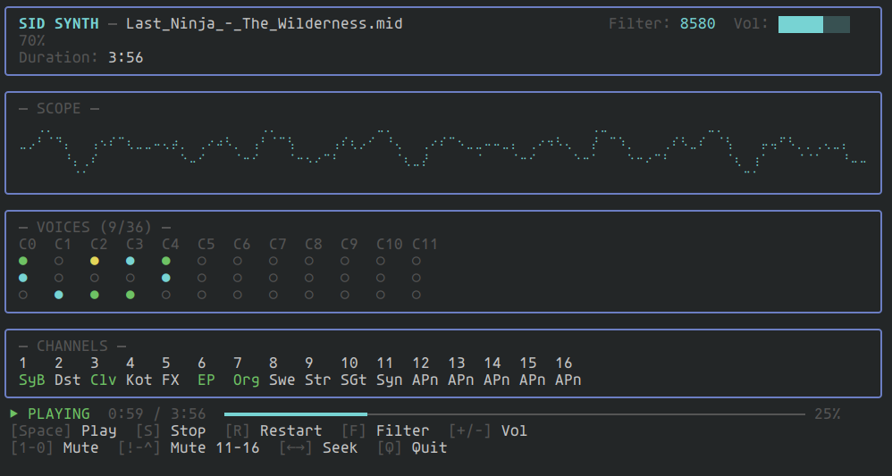

# SID Synth

A Commodore 64 SID chip synthesizer that plays standard MIDI files, written in Go.

Emulates the MOS 6581/8580 Sound Interface Device at the oscillator, envelope, and filter level. 12 SID chips (36 voices) with LRU voice allocation, a full General MIDI patch set mapped to SID waveforms, and sample-accurate MIDI playback.



## Building

```
make build    # builds ./sid-synth (TUI player)
make render   # builds ./render (offline WAV renderer)
```

Or directly:

```
go build -o sid-synth .
go build -o render ./cmd/render
```

## Usage

### TUI Player

```
./sid-synth [file.mid]
```

Launches a terminal UI with real-time audio playback. If a MIDI file is provided, playback starts automatically.

#### Controls

| Key | Action |
|-----|--------|
| `Space` | Play / Pause |
| `S` | Stop |
| `R` | Restart |
| `F` | Cycle filter model (8580 / 6581 / off) |
| `+` / `-` | Volume up / down |
| `Left` / `Right` | Seek ±5 seconds |
| `1`-`9`, `0` | Toggle mute channels 1-10 |
| `!` `@` `#` `$` `%` `^` | Toggle mute channels 11-16 |
| `Q` | Quit |

### Offline Renderer

```
./render [flags] <input.mid>
```

Renders a MIDI file to a WAV file using the same synthesis engine as the TUI.

#### Flags

| Flag | Default | Description |
|------|---------|-------------|
| `-o` | `<input>.wav` | Output WAV file path |
| `-filter` | `8580` | Filter model: `6581`, `8580`, `off` |
| `-vol` | `0.7` | Master volume (0.0-1.0) |
| `-release` | `1.0` | Seconds of release tail after last event |
| `-buf` | `2048` | Render buffer size in samples |

Example:

```
./render -filter 6581 -vol 0.8 bach_toccata.mid
./render -filter off -o output.wav song.mid
```

## Architecture

```
audio/       SID emulation core
  sid.go       Voice: oscillator (triangle/saw/pulse/noise), ADSR envelope, ring mod
  chip.go      Chip: 3 voices + state-variable filter (LP/BP/HP)
  filter.go    Filter: 6581 (S-curve, saturation) and 8580 (linear) models
  bank.go      Bank: 12 chips, voice allocation, MIDI channel routing
  engine.go    Engine: real-time audio output via Oto, oscilloscope ring buffer
  wav.go       WAV file writer

midi/        MIDI file handling
  parser.go    Standard MIDI file parser
  player.go    Sample-accurate MIDI event dispatcher (ProcessBlock)

sound/       Instrument definitions
  patches.go   128 General MIDI patches + GM percussion mapped to SID parameters

ui/          Terminal interface
  model.go     BubbleTea model, input handling, playback control
  view.go      Lipgloss layout, voice grid, channel display, progress bar
  plot.go      Braille character waveform renderer for oscilloscope

cmd/render/  Offline WAV renderer
main.go      TUI entry point
```

## SID Emulation

Each voice generates one of four waveforms at the SID's NTSC clock rate (1,022,727 Hz), downsampled to 44.1 kHz:

- **Triangle** — with optional ring modulation from the preceding voice
- **Sawtooth**
- **Pulse** — variable duty cycle (pulse width modulation)
- **Noise** — 23-bit LFSR

The ADSR envelope uses the original SID's 16-step attack/decay/release timing tables.

The state-variable filter supports low-pass, band-pass, and high-pass modes with two models:

- **6581** — nonlinear S-curve cutoff mapping, DC offset, asymmetric NMOS saturation
- **8580** — linear cutoff, exponential resonance, cleaner output

Mixing uses adaptive loudness scaling (divide by sqrt of active voices) with tanh soft clipping.
